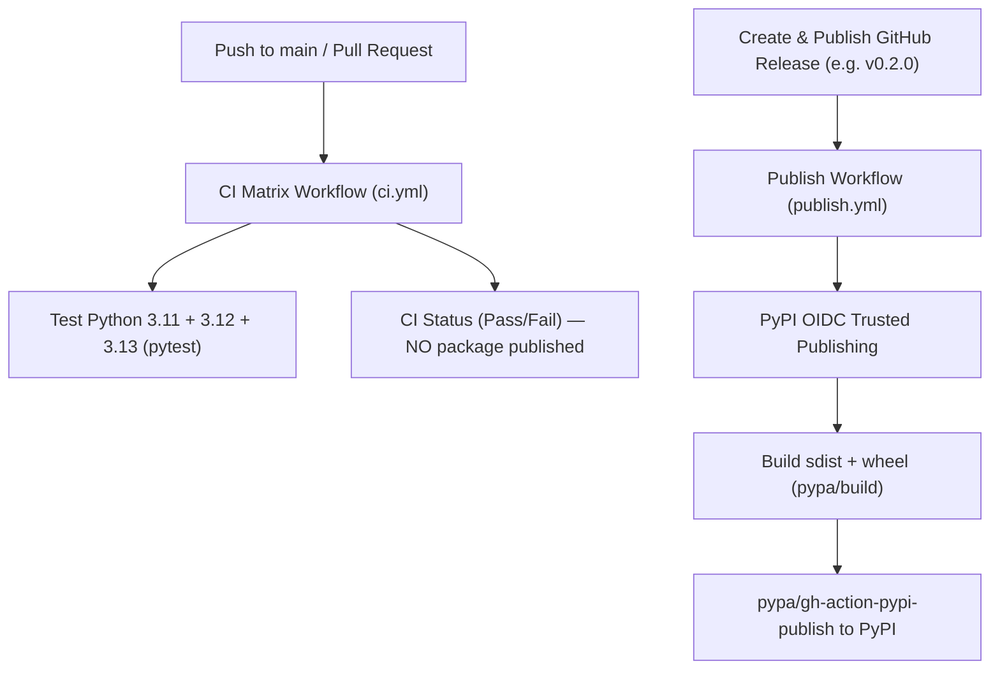

# AGENTS.md

> Guidance and instructions for AI coding agents working on the **`wirebox-python`** codebase (`wirebox`).

---

## 1. Project Overview

`wirebox-python` is the official Python SDK for **Wirebox** — the real-world identity, communication, and context execution layer for AI agents.

- **PyPI Package**: [`wirebox`](https://pypi.org/project/wirebox/)
- **GitHub Remote**: `git@github.com:wirebox-sh/wirebox-python.git`
- **Primary Stack**: Python 3.11+, `hatchling` (PEP 621 build backend), `httpx`, `websockets`, `pytest`, `ruff`
- **Supported Python Runtimes**: 3.11, 3.12, 3.13, 3.14-dev
- **Architecture Highlights**:
  - Dual Synchronous (`Wirebox` / `WireboxClient`) and Asynchronous (`AsyncWirebox` / `AsyncWireboxClient`) interfaces
  - Inkbox ecosystem compatibility aliases (`iter_emails`, `list_emails`, `body_text`)
  - WebSocket tunnel client with binary framing & bidirectional message proxying
  - Webhook HMAC-SHA256 signature verification

---

## 2. Directory Structure

```text
wirebox-python/
├── .github/
│   └── workflows/
│       ├── ci.yml              # CI: Matrix test across Python 3.11, 3.12, 3.13 on push/PR to main
│       └── publish.yml         # Release: PyPI Trusted Publishing via OIDC on GitHub Release
├── src/
│   └── wirebox/
│       ├── __init__.py         # Package exports & compatibility aliases
│       ├── _version.py         # Single source of truth for runtime __version__
│       ├── client.py           # Synchronous Wirebox client
│       ├── async_client.py     # Asynchronous AsyncWirebox client
│       ├── identity.py         # AgentIdentity & AsyncAgentIdentity domain models
│       ├── tunnels.py          # WebSocket tunnel sessions & client telemetry
│       ├── verify_webhook.py   # HMAC-SHA256 webhook signature verification
│       ├── exceptions.py       # Typed exception hierarchy
│       └── types.py            # Dataclasses & Pydantic-free schema definitions
├── tests/                      # Pytest unit & integration test suites
├── pyproject.toml              # Build backend, dependencies, ruff & pytest configuration
└── README.md                   # User-facing documentation
```

---

## 3. Development Commands

Always run commands inside the `wirebox-python/` directory:

| Task | Command | Purpose |
| :--- | :--- | :--- |
| **Install Dev Dependencies** | `pip install -e ".[dev]"` | Install package in editable mode with test dependencies |
| **Run Tests** | `pytest` | Run all unit tests across sync and async suites |
| **Run Tests with Coverage** | `pytest --cov=wirebox` | Run tests with coverage reporting |
| **Lint Code** | `ruff check src/ tests/` | Run Ruff linter checks |
| **Check Formatting** | `ruff format --check src/ tests/` | Verify code formatting |
| **Build Distribution** | `python -m build` | Build wheel and sdist in `dist/` |

---

## 4. Version Management Policy

The SDK follows **Semantic Versioning (SemVer)** conforming to PEP 440 (`MAJOR.MINOR.PATCH`).

⚠️ **CRITICAL: Dual Synchronization Points**:
When updating the Python SDK version, you **MUST** synchronize both locations:

1. **[`pyproject.toml`](pyproject.toml)**:
   ```toml
   [project]
   name = "wirebox"
   version = "<x.y.z>"
   ```
2. **[`src/wirebox/_version.py`](src/wirebox/_version.py)**:
   ```python
   __version__ = "<x.y.z>"
   ```

---

## 5. CI/CD & PyPI Release Workflow



### 5.1 Why Pushing to `main` Does NOT Publish
- Pushes to `main` trigger **only** [`.github/workflows/ci.yml`](.github/workflows/ci.yml), which runs unit tests against Python 3.11, 3.12, and 3.13.
- Publishing to PyPI occurs **exclusively** when a **GitHub Release** is created and published.

### 5.2 PyPI Trusted Publishing (OIDC)
- PyPI uses **Trusted Publishing** powered by OpenID Connect (OIDC).
- No long-lived PyPI API tokens or passwords are stored in GitHub repository secrets.
- Workflow configuration:
  - Uses `pypa/gh-action-pypi-publish@release/v1`.
  - Grants `id-token: write` permission for cryptographic exchange.
  - Automatically verifies against PyPI's trusted publisher registration for `wirebox-sh/wirebox-python`.

### 5.3 Step-by-Step Release Guide

To release a new version to PyPI:

1. **Synchronize Version**:
   - In [`pyproject.toml`](pyproject.toml), update `version = "<x.y.z>"`.
   - In [`src/wirebox/_version.py`](src/wirebox/_version.py), update `__version__ = "<x.y.z>"`.

2. **Verify Locally**:
   ```bash
   pytest
   ruff check src/ tests/
   ```

3. **Commit and Push to `main`**:
   ```bash
   git add pyproject.toml src/wirebox/_version.py
   git commit -m "chore(release): bump version to <x.y.z>"
   git push origin main
   ```
   Wait for CI to finish across all Python matrix runners.

4. **Trigger Release via GitHub CLI**:
   ```bash
   gh release create v<x.y.z> --title "v<x.y.z>" --notes "<release description>"
   ```

5. **Verify on PyPI**:
   ```bash
   curl -s https://pypi.org/pypi/wirebox/json | jq '.info.version'
   pip install --upgrade wirebox
   ```

---

## 6. Coding & Architecture Rules

1. **Dual Sync & Async Interfaces**: Every feature added to `Wirebox` (sync) must have a corresponding implementation in `AsyncWirebox` (async), keeping method signatures and return types identical.
2. **Zero Heavy Runtime Dependencies**: The SDK runtime dependencies must stay minimal (`httpx` and `websockets` only). Avoid adding Pydantic or heavy frameworks to keep installation fast in serverless/agent sandboxes.
3. **No Unverified Commits**: Follow the project golden rule: never commit until test suites pass cleanly across both sync and async suites.
